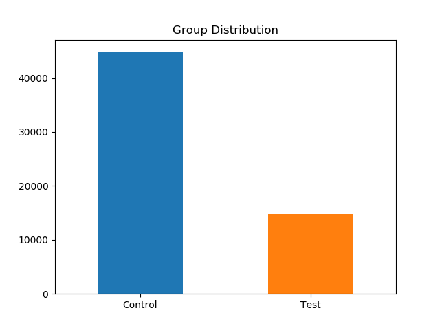

# My Answer to Seedbox Data Science Application Test
_**by Benoît Boucher, 2018-07-12**_

_For the complete problem description, see README.md._

## 1. What is the aproximate probability distribution between the test group and the control group

Total number of samples: 59721

Number of samples per group:
1. Control    44886
2. Test    14835

Fractional Distribution of samples per group:
1. Control    0.751595
2. Test  0.248405

**Approximate distribution:** 
1. Control    75%
2. Test  25%

## 2. Is a user that must call-in to cancel more likely to generate at least 1 additional REBILL?
To answer this question, we will count the number of each transactions for each group, then compare the ratio:

_number of REBILL / total number of transactions_

`ratio_test_RB > ratio_control_RB ?`

`0.9482248520710059 > 0.9274074074074075 ?`

`True`

**Answer: Yes**

## 3. Is a user that must call-in to cancel more likely to generate more revenues?
This is effectively the same as question 2 since revenues are directly proportional to REBILLs.
Therefore, more REBILLs implies more revenue. So the answer is the same:

`ratio_test_RB > ratio_control_RB ?`

`0.9482248520710059 > 0.9274074074074075 ?`

`True`

**Answer: Yes**

## 4. Is a user that must call-in more likely to produce a higher chargeback rate(CHARGEBACKs/REBILLs)?
To answer this question, we will calculate the following ratio for each group:

_number of CHARGEBACK / number of REBILL_

`test_CB_RB_rate > control_CB_RB_rate ?`

`0.017784711388455537 > 0.028221512247071354 ?`

`False`

**Answer: No**

## COMMENTS
This is as far as I can go within 3 hours.

Here are a few things we can use to make this analysis more thorough:
1. For question 1, Compare the group distribution for each type of transaction [REBILL, REFUND, CHARGEBACK]
2. For question 2, we could count the number of REBILLs for each unique Sample ID, then plot a histogram of the normalized population for each group. This would give us a statistical distribution that better answers the question.
3. For question 3, we could have actually calculated the mean revenue by doing the sum of revenues for each unique Sample ID and then look at the distributions for control Vs test groups 
4. For statistical significance in an A/B testing context, it is common to use [Welch's t-test](https://en.wikipedia.org/wiki/Welch%27s_t-test)

